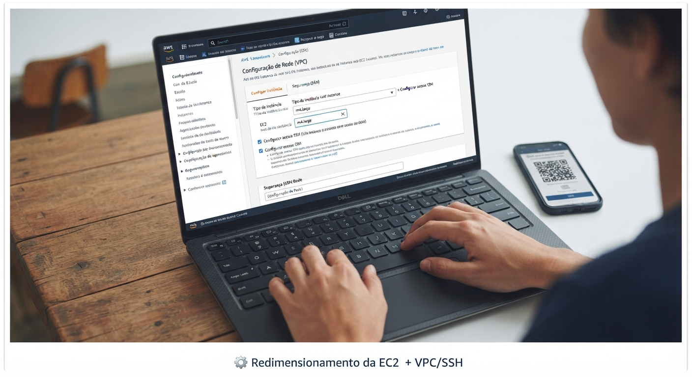
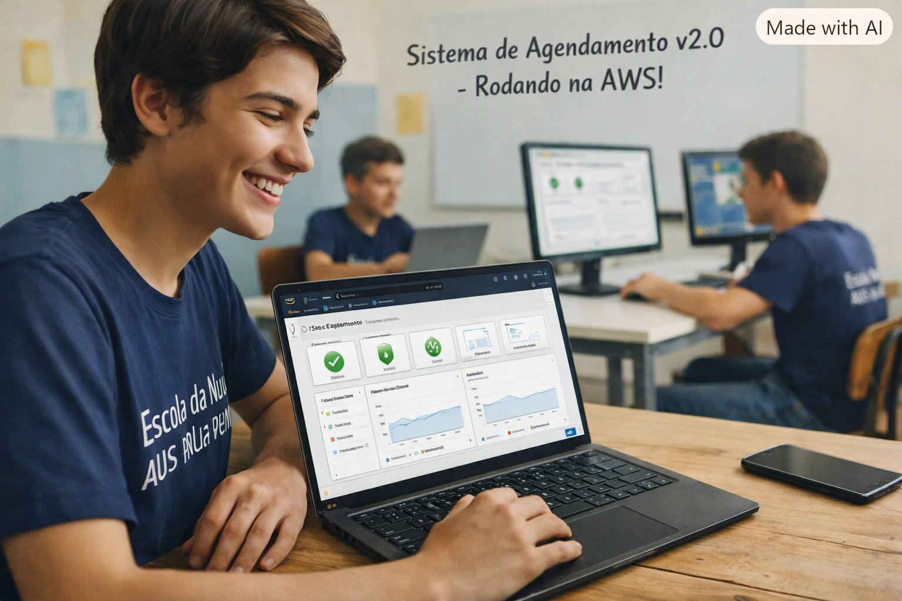

# AWS-SimuLearn-Compute-Solutions-EC2
Laboratório prático AWS SimuLearn sobre Amazon EC2, dimensionamento, gerenciamento, redes, segurança e validação de infraestrutura.

Neste laboratório, eu precisei resolver um problema de infraestrutura de uma escola cujo sistema de agendamento estava rodando em uma única instância EC2.  

  

Este laboratório foi um dos que mais gostei de fazer na trilha do AWS Skill Builder, porque não foi simplesmente seguir um passo a passo.
Eu recebi um problema para resolver. E precisei realmente parar, entender o problema e descobrir como resolver.

Não era simplesmente criar uma instância EC2 seguindo um tutorial.
Eu recebi um cenário de uma escola que precisava melhorar o sistema de agendamento de aulas. Esse sistema estava rodando em uma única instância Amazon EC2, mas já não estava conseguindo atender bem às necessidades da aplicação.

O problema estava relacionado principalmente à necessidade de mais poder computacional e memória.

E foi aí que começou o desafio.
Uma escola tinha um sistema de agendamento de aulas rodando em uma única instância Amazon EC2. O sistema estava precisando de mais poder computacional e memória para funcionar melhor. A partir daí, precisei entender o problema, conversar com o cliente fictício dentro do SimuLearn e descobrir qual seria a melhor solução.

## O problema

Primeiro: entender o problema

Antes de mexer no ambiente AWS, precisei entender o que o cliente estava precisando.

O sistema da escola precisava de mais recursos para funcionar melhor. Então, antes de simplesmente escolher uma EC2 maior, precisei analisar o cenário e entender quais características da instância seriam mais adequadas para aquela carga de trabalho.

Essa parte aconteceu dentro do próprio AWS SimuLearn, que simula uma situação de atendimento a um cliente.

Durante a atividade, também pude contar com o Dr. Newton, o agente de apoio do laboratório, quando precisei de ajuda para entender melhor o problema e o caminho que deveria seguir.

Foi interessante porque comecei a perceber que trabalhar com Cloud não é apenas conhecer os serviços da AWS.
O problema era **O sistema da escola estava rodando em uma EC2 que já não atendia tão bem às necessidades da aplicação** 

A primeira coisa que precisei entender foi:
O que realmente estava faltando nessa infraestrutura?
Não bastava simplesmente escolher uma instância maior. Era necessário entender o tipo de carga de trabalho e quais recursos seriam necessários.

Foi aí que comecei a analisar os diferentes tipos e famílias de instâncias EC2 e os conceitos de compute, memória e scaling.

## O conceito que mais desafiou minha compreensão - A ideia que mais estimulou meu raciocínio - O ponto que mais ampliou minha visão.

Uma das coisas interessantes do SimuLearn é que ele não entrega tudo pronto. Eu precisava tomar decisões e entender o motivo de cada uma delas.
Em alguns momentos, também contei com o Dr. Newton, o agente de apoio do laboratório, para me ajudar a raciocinar sobre o problema e validar o caminho que eu estava seguindo.

## Analisando as opções

Depois de entender a necessidade da escola, comecei a analisar os diferentes tipos e famílias de instâncias EC2.
Precisava encontrar uma configuração que oferecesse mais capacidade de processamento e memória para a aplicação.
Foi nesse momento que trabalhei com o conceito de right sizing.

A ideia não é simplesmente colocar a maior máquina disponível.
É encontrar um tamanho adequado para aquela carga de trabalho, levando em consideração os recursos necessários e evitando desperdício.
No cenário do laboratório, chegamos à necessidade de redimensionar a instância para o perfil m4.large.## Isso me fez perceber uma coisa importante:

Não adianta decorar o nome dos serviços AWS se não souber identificar qual problema preciso resolver.
Depois da análise, fui para o AWS Management Console trabalhar diretamente na infraestrutura.
Comecei localizando a instância EC2 utilizada pelo sistema da escola e analisando sua configuração.

  

## 1. Entendendo o gerenciamento da instância

E aí apareceu um obstáculo! Quando fui para o AWS Management Console começar a fazer as alterações, encontrei uma configuração de proteção que interferia no gerenciamento da instância. **Era o disableApiStop**

Eu precisava entender primeiro por que aquela ação estava sendo impedida.
Em vez de simplesmente tentar fazer a alteração de qualquer maneira, precisei investigar a configuração e entender o papel daquela proteção no ciclo de vida da instância.

Foi uma parte que gostei bastante porque aconteceu uma coisa que provavelmente acontece em um ambiente real:
Uma alteração aparentemente simples pode estar bloqueada por uma configuração de proteção.

Depois de entender o motivo, consegui tratar essa configuração e seguir com o gerenciamento da instância.Durante o laboratório, encontrei uma configuração de proteção relacionada ao ciclo de vida da instância: **disableApiStop**

Precisei entender por que determinada operação não estava sendo permitida e o que aquela proteção significava.
Foi uma parte importante do laboratório porque mostrou, na prática, que uma configuração de segurança pode impedir uma ação administrativa — e que antes de simplesmente tentar “forçar” uma alteração, precisamos entender o motivo da proteção.

  

## 2. Redimensionando a EC2

Com o problema da proteção resolvido, pude continuar com a alteração da infraestrutura.
O objetivo era aumentar a capacidade da EC2 para atender melhor às necessidades do sistema da escola.

Fiz o redimensionamento da instância para o perfil definido no cenário, m4.large, e depois precisei acompanhar o estado da instância para confirmar que a alteração tinha sido realizada corretamente. O importante era adequar os recursos da instância às necessidades da aplicação.
Analisei os tipos de instância disponíveis e trabalhei com o conceito de right sizing, buscando uma configuração mais adequada para o workload.
No cenário do laboratório, a instância foi redimensionada para o perfil m4.large.

Foi aqui que o conceito estudado começou a fazer mais sentido para mim.
No material teórico, eu aprendo que existem diferentes famílias e tamanhos de instâncias.
No laboratório, precisei responder à pergunta:
“Qual delas faz sentido para este problema?”

Aqui ficou muito claro para mim que escolher uma instância não significa simplesmente escolher “a maior”.
É preciso relacionar:

Carga de trabalho → processamento → memória → desempenho → custo.

  

## 3. Conectividade e segurança

Também precisei olhar para a conectividade. O trabalho não terminou no tamanho da EC2.
Também precisei verificar a parte de conectividade e acesso à instância.

Precisava garantir que a instância estivesse corretamente conectada à rede e que o acesso administrativo estivesse configurado de acordo com as regras de segurança do ambiente. Essa etapa me ajudou a perceber como as coisas estão relacionadas.

A EC2 não está isolada.
Ela depende da rede, das regras de segurança e das configurações que permitem ou bloqueiam determinados acessos. 
Também precisei verificar a parte de conectividade da instância.

Trabalhei com conceitos de:

Amazon VPC
Security Groups
SSH
Acesso administrativo à instância

Essa etapa me ajudou a entender melhor como compute, rede e segurança estão conectados dentro da AWS.

## E o armazenamento?

Também precisei verificar os volumes associados à instância.
Aqui entrei em contato com o Amazon EBS, que é utilizado como armazenamento de bloco para as instâncias EC2.
A ideia era garantir que, depois das alterações realizadas na instância, o armazenamento necessário para o sistema continuasse corretamente associado.
Mais uma vez, foi uma etapa importante porque mostrou que, quando estamos mexendo em uma infraestrutura, não podemos olhar apenas para um recurso isoladamente.

## 4. Amazon EBS

Outra parte da validação foi verificar os volumes de armazenamento associados à instância.
Nesse momento, trabalhei com Amazon EBS, entendendo a relação entre o armazenamento persistente e a instância EC2.

## O que eu aprendi com esse laboratório

O maior aprendizado não foi simplesmente aprender a alterar o tipo de uma EC2.
Foi entender o processo de resolução de um problema de infraestrutura.

Eu precisei:
Entender o problema → analisar os requisitos → avaliar as opções → identificar as limitações → fazer as alterações → validar o resultado.
Também percebi que existe uma diferença grande entre estudar um serviço e realmente utilizá-lo para resolver um problema.

## Na Trilha Skill Builder, em prática na EC2.

No laboratório, precisei descobrir o que fazer com aquela EC2 diante de um problema realista.

## Como o problema foi resolvido

No final, o caminho que segui foi basicamente este:

Entender o problema do cliente
↓
Analisar as necessidades de processamento e memória
↓
Avaliar os tipos de instância EC2
↓
Identificar a proteção disableApiStop
↓
Entender e tratar o bloqueio
↓
Redimensionar a EC2 para m4.large
↓
Verificar conectividade, segurança e SSH
↓
Validar os volumes EBS
↓
Confirmar o estado final da infraestrutura

  

## AWS utilizadas neste laboratório
Amazon EC2
Amazon VPC
Security Groups
Amazon EBS
SSH
Conceitos trabalhados
EC2 Instance Types
Right Sizing
Scaling
Ciclo de vida de instâncias
Proteção de instâncias
Conectividade
Segurança
Gerenciamento de infraestrutura

## O que esse laboratório me ensinou - Minha conclusão

Para mim, o mais importante nesse laboratório não foi simplesmente aprender a mudar o tamanho de uma EC2.
Foi aprender a resolver um problema de infraestrutura.
Eu precisei entender o que o cliente precisava, analisar o ambiente, descobrir por que uma operação estava sendo bloqueada, pesquisar o significado daquela configuração, fazer a alteração necessária e depois validar se tudo estava funcionando.

Isso é muito diferente de apenas assistir a uma aula sobre EC2.
Eu estou começando a perceber que aprender Cloud é justamente fazer essa ligação:

problema → análise → decisão → implementação → validação.

Porque juntou duas coisas que considero fundamentais na minha transição para Cloud:

Entender a necessidade do cliente e conseguir colocar a solução em prática.
Foi mais um exercício de sair da teoria e começar a pensar como alguém que precisa analisar, decidir, implementar e validar uma solução na nuvem.

Mais um laboratório concluído na minha jornada para Cloud.
E é esse tipo de experiência prática que quero continuar construindo durante minha transição para Cloud Engineer.

## Sobre a autora

Sou profissional da área de Tecnologia, em transição de Análise de Dados para Cloud Engineering.
Este repositório faz parte da minha jornada de aprendizado, onde registro não apenas os resultados dos laboratórios, mas também os problemas que encontrei, as decisões que tomei e o que aprendi durante cada prática.

GitHub: Dinizasilva
LinkedIn: www.linkedin.com/in/eliana-diniz
E-mail: eliana.dinizsilva@gmail.com

