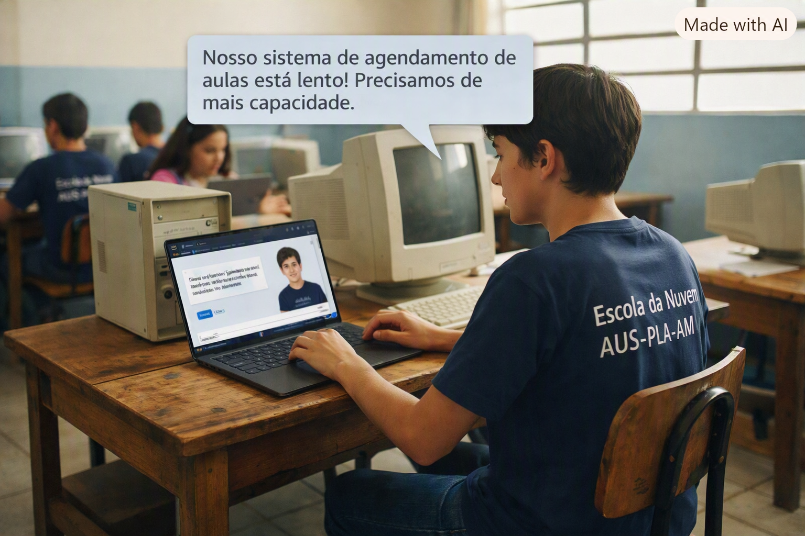
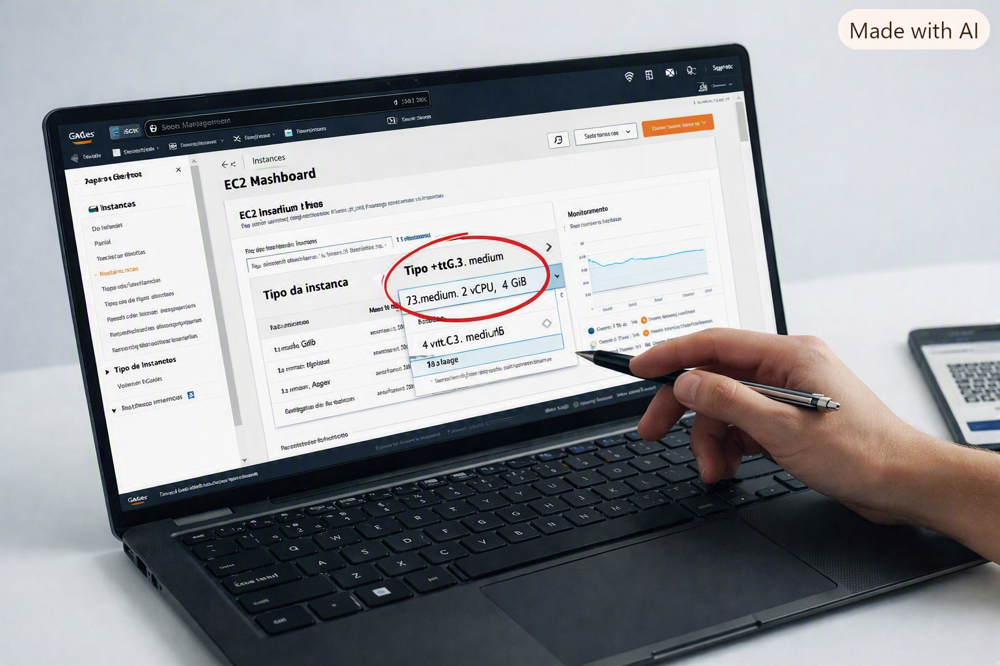

# AWS-SimuLearn-Compute-Solutions-EC2
Laboratório prático AWS SimuLearn sobre Amazon EC2, dimensionamento, gerenciamento, redes, segurança e validação de infraestrutura.

Neste laboratório, eu precisei resolver um problema de infraestrutura de uma escola cujo sistema de agendamento estava rodando em uma única instância EC2.  

  

Este laboratório foi um dos que mais gostei de fazer na trilha do AWS Skill Builder, porque não foi simplesmente seguir um passo a passo.

Eu recebi um problema para resolver.
Uma escola tinha um sistema de agendamento de aulas rodando em uma única instância Amazon EC2. O sistema estava precisando de mais poder computacional e memória para funcionar melhor. A partir daí, precisei entender o problema, conversar com o cliente fictício dentro do SimuLearn e descobrir qual seria a melhor solução.

## O problema

O sistema da escola estava rodando em uma EC2 que já não atendia tão bem às necessidades da aplicação.A primeira coisa que precisei entender foi:

O que realmente estava faltando nessa infraestrutura?
Não bastava simplesmente escolher uma instância maior. Era necessário entender o tipo de carga de trabalho e quais recursos seriam necessários.

Foi aí que comecei a analisar os diferentes tipos e famílias de instâncias EC2 e os conceitos de compute, memória e scaling.

## O conceito que mais desafiou minha compreensão - A ideia que mais estimulou meu raciocínio - O ponto que mais ampliou minha visão.

Uma das coisas interessantes do SimuLearn é que ele não entrega tudo pronto. Eu precisava tomar decisões e entender o motivo de cada uma delas.
Em alguns momentos, também contei com o Dr. Newton, o agente de apoio do laboratório, para me ajudar a raciocinar sobre o problema e validar o caminho que eu estava seguindo.

## Isso me fez perceber uma coisa importante:

Não adianta decorar o nome dos serviços AWS se eu não souber identificar qual problema preciso resolver.
Depois da análise, fui para o AWS Management Console trabalhar diretamente na infraestrutura.
Comecei localizando a instância EC2 utilizada pelo sistema da escola e analisando sua configuração.

  

## 1. Entendendo o gerenciamento da instância

Durante o laboratório, encontrei uma configuração de proteção relacionada ao ciclo de vida da instância: **disableApiStop**

Precisei entender por que determinada operação não estava sendo permitida e o que aquela proteção significava.
Foi uma parte importante do laboratório porque mostrou, na prática, que uma configuração de segurança pode impedir uma ação administrativa — e que antes de simplesmente tentar “forçar” uma alteração, precisamos entender o motivo da proteção.

## 2. Redimensionando a EC2

Depois veio uma das partes principais do desafio: adequar os recursos da instância às necessidades da aplicação.
Analisei os tipos de instância disponíveis e trabalhei com o conceito de right sizing, buscando uma configuração mais adequada para o workload.
No cenário do laboratório, a instância foi redimensionada para o perfil m4.large.
Aqui ficou muito claro para mim que escolher uma instância não significa simplesmente escolher “a maior”.

É preciso relacionar:

Carga de trabalho → processamento → memória → desempenho → custo.

  

